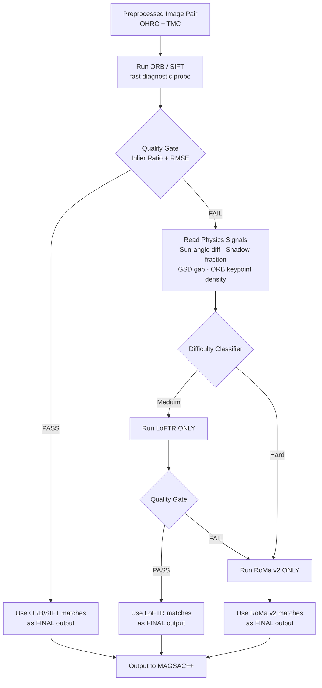

# Model Recommendation System

**Part of: LunarSync — Cross-Sensor Lunar Image Correspondence Pipeline**

---

## 1. Overview

The **Model Recommendation System** is a lightweight *pre-matching* decision layer that selects **one** correspondence-matching model per image pair — instead of running multiple heavy dense/semi-dense matchers sequentially on the same pair.

Instead of a brute-force cascade (*try ORB → if it fails try LoFTR → if that fails try RoMa v2*), this system uses **ORB (or SIFT) as a cheap diagnostic probe**, combined with physics-derived difficulty signals already produced elsewhere in the pipeline, to directly route each image pair to the correct matcher the first time.

| | Naive Cascade | Model Recommendation System |
|---|---|---|
| Easy pair | ORB only | ORB only |
| Medium pair | ORB (fail) → LoFTR (pass) | ORB (fail, used as signal) → LoFTR (pass) |
| Hard pair | ORB (fail) → LoFTR (fail) → RoMa v2 (pass) — **3 models run** | ORB (fail, used as signal) → RoMa v2 (pass) — **2 models run** |

The system never discards ORB's compute — it reuses the attempt itself as a **diagnostic signal**, so nothing is wasted.

---

## 2. Problem Statement

Our pipeline must correspond **OHRC and TMC** (and optionally IIRS) image pairs that differ in:
- Scale / Ground Sample Distance (GSD)
- Sun-angle and shadow geometry
- Texture richness (30–40% of lunar terrain is low-texture)
- Sensor modality

Different matchers have very different strengths here:

| Matcher | Type | Strength | Weakness |
|---|---|---|---|
| **ORB / SIFT** | Sparse, classical | Extremely fast (~10–30 ms), good on high-texture, well-lit regions | Fails on low-texture, shadowed, or extreme-scale-gap regions |
| **LoFTR** | Semi-dense, transformer | Detector-free, works without salient keypoints, moderate cost (~100–300 ms) | Still struggles on fully textureless regions; weaker under large scale gaps |
| **RoMa v2** | Dense, foundation-model-backed | Best accuracy on low-texture, shadow-heavy, cross-modal, large scale-gap pairs | Heaviest compute (~300 ms–1 s+), GPU memory intensive |

Running all three on every pair wastes compute on pairs that a cheap matcher could already solve, **and** wastes compute re-running cheap matchers on pairs that were always going to need RoMa v2.

---

## 3. Flow Diagram



**Key design rule:** at most **two** matchers ever run on a given pair — the diagnostic (ORB/SIFT) and exactly one correspondence matcher (LoFTR *or* RoMa v2), never both in sequence.

---

## 4. How It Works — Step by Step

### Step 1 — Run ORB / SIFT (diagnostic probe, not final by default)
ORB or SIFT is run on every pair first. This is intentional even though it is a classical, sparse method — its cost is negligible (tens of milliseconds) compared to LoFTR or RoMa v2, so using it as a probe is essentially free.

### Step 2 — Quality Gate
```
inlier_ratio = inliers / total_matches
PASS  if inlier_ratio > 0.6 AND RMSE < 2.0 px
FAIL  otherwise
```
If it passes, the pair was *easy* — ORB's own matches are used directly. **No further model runs.**

### Step 3 — Physics-Based Difficulty Signals (already available elsewhere in the pipeline — zero extra cost)
| Signal | Source | Meaning |
|---|---|---|
| Sun-angle difference | SPICE (incidence angle, OHRC vs TMC) | Large difference → shadow mismatch → harder |
| Shadow fraction | Ray-traced shadow mask (DEM + sun geometry) | More shadow area → harder |
| GSD / scale gap | Sensor metadata (fixed, known) | Large resolution gap → harder |
| Keypoint density from ORB | ORB's own output in Step 1 | Near-zero keypoints → very low texture → go straight to RoMa v2 |

### Step 4 — Route to exactly one matcher
```
IF ORB found almost no keypoints at all (texture ~absent):
      → RoMa v2 directly (LoFTR would likely fail too — skip it)
ELSE IF ORB found keypoints but failed the quality gate:
      → LoFTR
      → if LoFTR also fails the quality gate → RoMa v2 (rare fallback)
```

### Step 5 — Final matches handed to MAGSAC++
Whichever matcher succeeded contributes the final correspondence set, which then proceeds to the existing robust-geometry-verification stage (MAGSAC++ → spatially uniform selection → transformation).

---

## 5. Models Used

| Model | Role in this feature |
|---|---|
| **ORB** (and/or **SIFT**) | Diagnostic probe + final matcher for easy pairs |
| **LoFTR** | Mid-tier matcher for moderately difficult pairs |
| **RoMa v2** | Matcher of last resort for hard pairs (low-texture, heavy shadow, large scale-gap, cross-modal) |

---

## 6. Feasibility — Can We Actually Build This?

**Yes.** Every component already exists as a standard, published, pretrained method — this is an orchestration layer on top of existing models, not a new model that needs to be trained from scratch.

- **ORB** and **SIFT** are built into OpenCV (`cv2.ORB_create()`, `cv2.SIFT_create()`) — no training required, no GPU required.
- **LoFTR** has official pretrained weights and inference code (Sun et al., *"LoFTR: Detector-Free Local Feature Matching with Transformers,"* CVPR 2021, arXiv:2104.00680).
- **RoMa v2** has official pretrained weights, a public pip package, and a documented inference API (`model.match(img_A, img_B)`):
  - Paper: Edstedt et al., *"RoMa v2: Harder Better Faster Denser Feature Matching,"* arXiv:2511.15706 (2025) — https://arxiv.org/abs/2511.15706
  - Code: https://github.com/Parskatt/RoMaV2
  - PyPI: https://pypi.org/project/romav2/
- The **quality-gate thresholds** (inlier ratio, RMSE) are standard RANSAC-style metrics already computed by OpenCV / MAGSAC++ in our pipeline — no new infrastructure needed.
- The **routing logic** itself is a simple rule-based decision tree (if/else on numeric signals) — it needs no training data and no model of its own, which keeps it fully explainable and avoids the "black-box" risk of a learned router.

### Evidence that difficulty varies predictably by texture/shadow (why the signals work)
- The RoMa v2 paper itself demonstrates that **dense matchers succeed where semi-dense/sparse matchers fail specifically on low-texture surfaces** (Section 3.4, Fig. 6b — textureless road surfaces: RoMa's/RoMa v2's warp succeeds where sparse methods fail).
- LoFTR's own paper describes it as "detector-free," explicitly built to handle *some* low-texture cases that ORB/SIFT cannot — supporting the idea of an easy → medium → hard tier.
- RoMa (the RoMa-family architecture) has already been applied to **lunar OHRC imagery** in prior work (CHANDRASUTRA project, https://github.com/Ayushcodes-hub/CHANDRASUTRA — OHRC–NAC matching pipeline using RoMa + RANSAC), confirming this class of matcher is viable on the exact sensor type we use.

### What is *not* proven yet (honest limitation)
- The exact numeric thresholds (texture-entropy cutoff, shadow-fraction cutoff, etc.) are **not published for lunar imagery** — they must be empirically calibrated on our own OHRC–TMC dataset. This is a calibration task, not a feasibility risk.
- No published paper has run **RoMa v2 specifically** on OHRC–TMC pairs yet — our use is a novel application of an existing, proven architecture to a new domain, not an invention of a new architecture.

---

## 7. Expected Benefit

| Pair difficulty | Models run (before) | Models run (after) | Compute saved |
|---|---|---|---|
| Easy | ORB only | ORB only | None (already optimal) |
| Medium | ORB → LoFTR | ORB → LoFTR | None (already optimal) |
| Hard | ORB → LoFTR → RoMa v2 | ORB → RoMa v2 | **One full LoFTR pass removed** |

For a dataset where a meaningful fraction of pairs are hard (as expected for lunar cross-sensor imagery with 30–40% low-texture terrain), this removes one redundant heavy-model pass per hard pair, while keeping every decision traceable to a physical or geometric signal rather than a learned black box.
