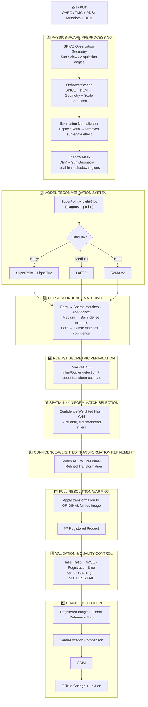
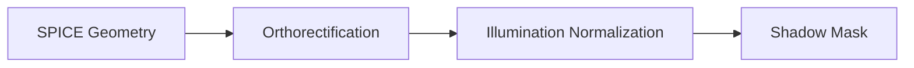
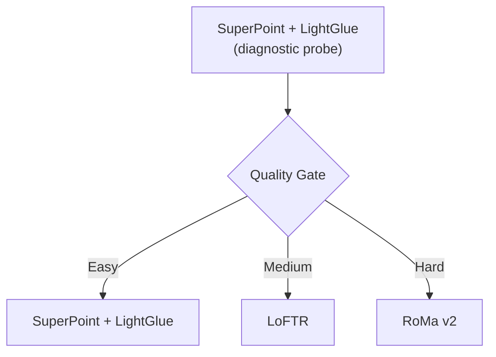
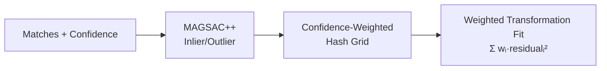
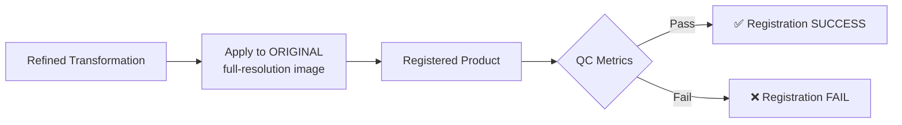
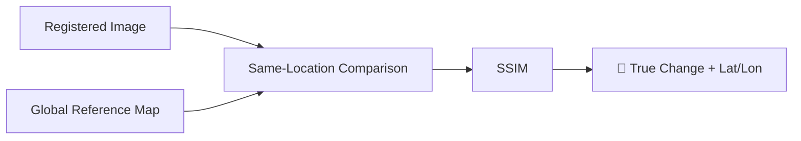

# LunarSync

**Cross-Sensor Lunar Image Correspondence & Change Detection**
Chandrayaan-2 OHRC ↔ TMC-2 Registration Pipeline

---

## 🛰️ Pipeline at a Glance

---

## 🧩 The 9 Stages — Visual Summary

| # | Stage | Input → Output |
|---|---|---|
| 1 | **Physics-Aware Preprocessing** | Raw OHRC/TMC + DEM → geometry-corrected, illumination-normalized, shadow-mapped images |
| 2 | **Model Recommendation System** | Image pair → routed to Easy / Medium / Hard tier |
| 3 | **Correspondence Matching** | Routed pair → sparse / semi-dense / dense matches, each with confidence |
| 4 | **Robust Geometric Verification** | Raw matches → inliers only, via MAGSAC++ |
| 5 | **Spatially Uniform Match Selection** | Inliers → evenly-distributed, confidence-weighted subset |
| 6 | **Confidence-Weighted Transformation Refinement** | Selected matches → final transformation matrix |
| 7 | **Full-Resolution Warping** | Transformation + original full-res image → registered product |
| 8 | **Validation & QC** | Registered product → pass/fail metrics |
| 9 | **Change Detection** | Registered image + reference map → confirmed changes with lat/lon |

---

## 🧭 Stage 1 — Physics-Aware Preprocessing

| Block | What it fixes |
|---|---|
| SPICE Observation Geometry | Where the sun and spacecraft actually were at capture time |
| Orthorectification | Scale mismatch + viewing-angle distortion (SPICE + DEM) |
| Illumination Normalization | Shadow/brightness mismatch caused by different sun angles (Hapke / Ratio) |
| Shadow Mask | Flags which regions are reliable vs. shadow-corrupted |

---

## 🧭 Stage 2 — Model Recommendation System

> Only **one** correspondence model ever runs per pair for the actual matching — the probe decides which one, so no redundant heavy-model passes.

---

## 🧭 Stage 3–6 — Matching → Verification → Selection → Refinement

- **High-confidence matches** → strongly influence the final transformation
- **Low-confidence matches** (shadow-boundary, low-texture) → automatically down-weighted, never discarded outright

---

## 🧭 Stage 7–8 — Warping & Validation

| QC Metric | Checks |
|---|---|
| Total Correspondences | How many matches were found overall |
| Inlier Match Count / Ratio | How many survived geometric verification |
| Reprojection RMSE | Average pixel error after alignment |
| Registration Error | Overall alignment accuracy |
| Spatial Match Coverage | Whether matches span the whole image, not just one corner |

---

## 🧭 Stage 9 — Change Detection

---

## 🗂️ Models Used

| Model | Role |
|---|---|
| **SuperPoint + LightGlue** | Fast diagnostic probe + final matcher for easy pairs |
| **LoFTR** | Medium-difficulty semi-dense matcher |
| **RoMa v2** | Dense matcher for hard pairs (low-texture, heavy-shadow, large scale-gap) |
| **MAGSAC++** | Robust geometric outlier rejection |

---

## 📌 One-Line Summary

**Correct for physics first → pick the cheapest matcher that will work → verify robustly → weight everything by confidence → warp the original full-resolution image → check it actually passed → compare against the global map to flag real surface change.**
